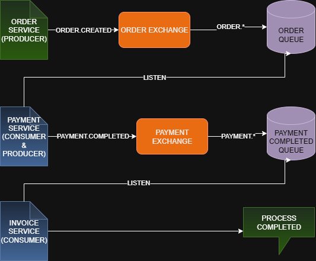

# Microservice Project With RabbitMQ and Docker

In this system, microservices communicate via RabbitMQ. Each message is sent through an exchange using a specific routing key, and the corresponding consumer listens to the appropriate queue.


## API Reference

#### New Order

```http
  POST http://localhost:8080/api/orders
```

| Parameter | Type     | Description                |
| :-------- | :------- | :------------------------- |
| `body`    | `OrderDTO` | **Required**. Data of the new order |


### OrderDTO Example

```json
{
  "orderId": "123",
  "productName": "Macbook",
  "quantity": 1
}
```


## Setup & Running

Clone the repository and navigate into it:

```bash
git clone https://github.com/Enesguzel1/MicroserviceProjectWithRabbitMQ.git
cd MicroserviceProjectWithRabbitMQ
```
Start all services using Docker Compose:
```bash
  docker-compose up --build

```
    
## Ports of Services

- order-service : 8080

- payment-service : 8081

- invoice-service : 8082

## Structure of RabbitMQ 
  

